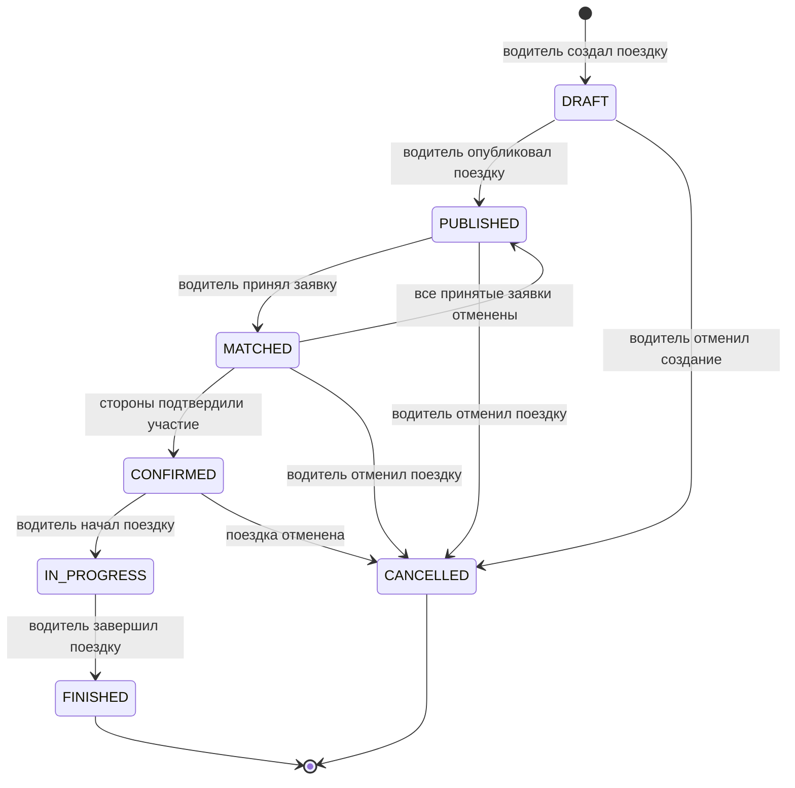

# ShareTrip

## Жизненный цикл Trip

В документе описаны состояния домена **Trip (Поездка)**, допустимые переходы между ними и роли, которые могут инициировать каждый переход.

## 1. Состояния Trip

| Состояние | Описание |
|---|---|
| `DRAFT` | Поездка создана водителем, но еще не опубликована. |
| `PUBLISHED` | Поездка опубликована и доступна пассажирам для подачи заявок. |
| `MATCHED` | Водитель принял хотя бы одну заявку пассажира, но участие еще не подтверждено всеми сторонами. |
| `CONFIRMED` | Водитель и принятые пассажиры подтвердили участие в поездке. |
| `IN_PROGRESS` | Поездка началась. Новые заявки и бронирования недоступны. |
| `FINISHED` | Поездка завершена. Состояние является конечным. |
| `CANCELLED` | Поездка отменена водителем или Platform. Состояние является конечным. |

Ранее использовавшееся состояние `OPEN` разделено на `DRAFT`, `PUBLISHED`, `MATCHED`, `CONFIRMED` и `IN_PROGRESS`. Состояние `COMPLETED` заменено на `FINISHED` в соответствии с заданием.

## 2. Диаграмма состояний

## 3. Переходы между состояниями

### 3.1. Создание поездки

**Переход:** начальное состояние → `DRAFT`

**Инициатор:** водитель.

**Когда:** водитель планирует поездку.

**Условия:**

- указаны место начала и завершения поездки;
- указан планируемый период поездки;
- указано количество свободных мест;
- указана стоимость каждого места.

**Последствия:**

- создается Trip в состоянии `DRAFT`;
- поездка доступна для изменения водителю;
- поездка не отображается пассажирам.

---

### 3.2. Публикация поездки

**Переход:** `DRAFT` → `PUBLISHED`

**Инициатор:** водитель.

**Когда:** водитель завершил подготовку поездки и готов принимать заявки пассажиров.

**Условия:**

- заполнены обязательные сведения о поездке;
- время поездки еще не наступило;
- количество свободных мест больше нуля.

**Последствия:**

- поездка становится доступна пассажирам;
- пассажиры могут подавать заявки;
- созданные Slot получают состояние `FREE`.

---

### 3.3. Принятие заявки пассажира

**Переход:** `PUBLISHED` → `MATCHED`

**Инициатор:** водитель.

**Когда:** пассажир подал заявку, а водитель согласен принять пассажира.

**Условия:**

- заявка пассажира активна;
- в поездке достаточно свободных мест;
- условия заявки соответствуют условиям поездки;
- поездка находится в состоянии `PUBLISHED`.

**Последствия:**

- заявка пассажира принимается;
- необходимое количество Slot переходит из `FREE` в `RESERVED`;
- Trip переходит в состояние `MATCHED`.

---

### 3.4. Подтверждение участия

**Переход:** `MATCHED` → `CONFIRMED`

**Инициаторы:** водитель и пассажиры, чьи заявки были приняты.

**Когда:** стороны согласовали условия поездки и готовы принять в ней участие.

**Условия:**

- водитель подтвердил поездку;
- все принятые пассажиры подтвердили участие;
- забронированные места остаются доступными соответствующим пассажирам;
- время поездки еще не наступило.

**Последствия:**

- договоренность об участии считается подтвержденной;
- Trip переходит в состояние `CONFIRMED`;
- изменение основных условий поездки ограничивается.

---

### 3.5. Возврат поездки к публикации

**Переход:** `MATCHED` → `PUBLISHED`

**Инициатор:** Platform.

**Когда:** все принятые заявки пассажиров отменены до подтверждения участия.

**Условия:**

- в поездке не осталось принятых заявок;
- поездка еще не подтверждена;
- время поездки еще не наступило;
- водитель не отменил поездку.

**Последствия:**

- забронированные Slot переходят из `RESERVED` в `FREE`;
- поездка снова становится доступна для подачи заявок;
- Trip возвращается в состояние `PUBLISHED`.

---

### 3.6. Начало поездки

**Переход:** `CONFIRMED` → `IN_PROGRESS`

**Инициатор:** водитель.

**Когда:** водитель и пассажиры начали поездку.

**Условия:**

- поездка находится в состоянии `CONFIRMED`;
- наступило запланированное время поездки;
- водитель подтвердил начало поездки.

**Последствия:**

- Trip переходит в состояние `IN_PROGRESS`;
- подача новых заявок и бронирование мест запрещаются;
- отмена участия пассажиром становится недоступна.

---

### 3.7. Завершение поездки

**Переход:** `IN_PROGRESS` → `FINISHED`

**Инициатор:** водитель.

**Когда:** маршрут поездки завершен.

**Условия:**

- поездка находится в состоянии `IN_PROGRESS`;
- водитель подтверждает завершение поездки.

**Последствия:**

- Trip переходит в состояние `FINISHED`;
- Slot в состоянии `RESERVED` переходят в `COMPLETED`;
- дальнейшее изменение поездки запрещается.

---

### 3.8. Отмена неопубликованной поездки

**Переход:** `DRAFT` → `CANCELLED`

**Инициатор:** водитель.

**Когда:** водитель отказывается от создания поездки до ее публикации.

**Условия:**

- поездка находится в состоянии `DRAFT`;
- поездка еще не опубликована.

**Последствия:**

- Trip переходит в состояние `CANCELLED`;
- поездка не становится доступна пассажирам.

---

### 3.9. Отмена опубликованной или согласованной поездки

**Переходы:**

- `PUBLISHED` → `CANCELLED`;
- `MATCHED` → `CANCELLED`;
- `CONFIRMED` → `CANCELLED`.

**Инициаторы:**

- водитель;
- Platform — при наступлении предусмотренных системой оснований для отмены.

**Когда:** поездка не может состояться.

**Условия:**

- поездка еще не началась;
- инициатор имеет право отменить поездку;
- причина отмены зафиксирована.

**Последствия:**

- Trip переходит в состояние `CANCELLED`;
- все активные заявки отменяются;
- Slot в состояниях `FREE` и `RESERVED` переходят в `CANCELLED`;
- пассажиры получают информацию об отмене;
- факт и инициатор отмены сохраняются в истории.

## 4. Матрица переходов и ролей

| Исходное состояние | Новое состояние | Инициатор |
|---|---|---|
| Начальное состояние | `DRAFT` | водитель |
| `DRAFT` | `PUBLISHED` | водитель |
| `DRAFT` | `CANCELLED` | водитель |
| `PUBLISHED` | `MATCHED` | водитель |
| `PUBLISHED` | `CANCELLED` | водитель или Platform |
| `MATCHED` | `CONFIRMED` | водитель и принятые пассажиры |
| `MATCHED` | `PUBLISHED` | Platform |
| `MATCHED` | `CANCELLED` | водитель или Platform |
| `CONFIRMED` | `IN_PROGRESS` | водитель |
| `CONFIRMED` | `CANCELLED` | водитель или Platform |
| `IN_PROGRESS` | `FINISHED` | водитель |

## 5. Недопустимые переходы

- из `FINISHED` и `CANCELLED` нельзя перейти в другое состояние;
- нельзя начать поездку из состояний `DRAFT`, `PUBLISHED` или `MATCHED`;
- нельзя завершить поездку, которая не находится в состоянии `IN_PROGRESS`;
- нельзя вернуть поездку из `CONFIRMED` в `PUBLISHED`;
- пассажир не может отменить Trip целиком — он может отменить только собственную заявку или участие;
- Platform не изменяет состояние Trip без зафиксированного основания.

## 6. История изменений

Каждый переход Trip должен сохраняться в истории. Для перехода фиксируются:

- предыдущее состояние;
- новое состояние;
- инициатор перехода;
- дата и время перехода;
- основание или причина перехода;
- связанные заявки и забронированные места.
